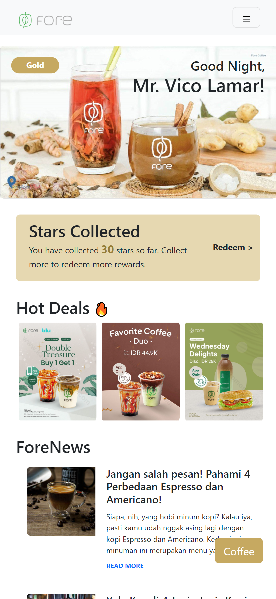
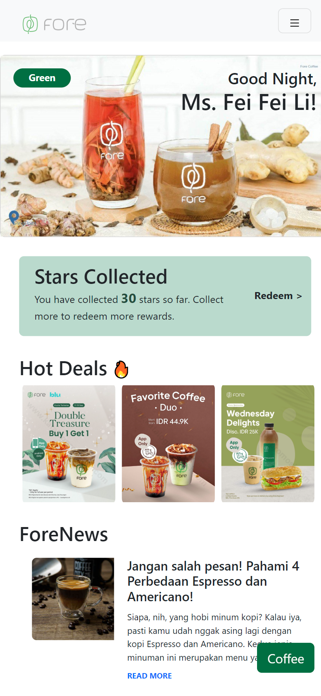
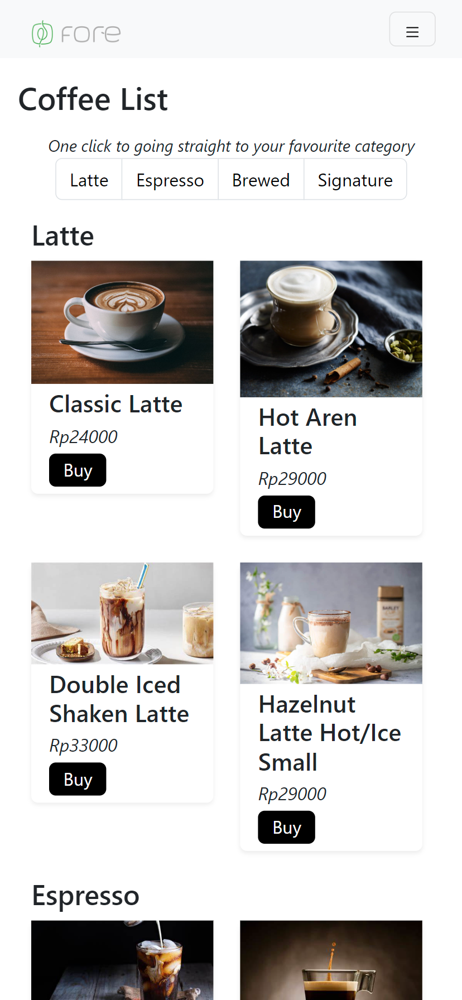
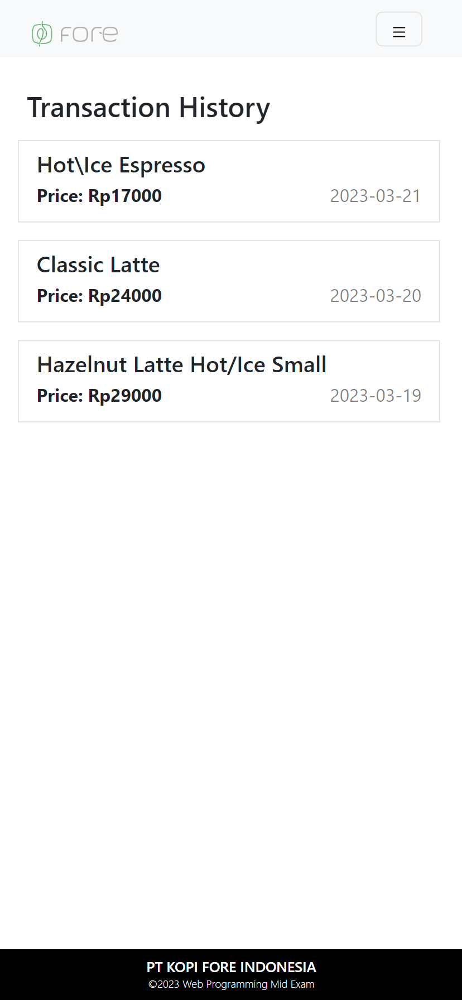

<h1>UTS Web Programming</h1>

Nama: Diana Petrina Santoso

NIM: 2440015442

## Penjelasan UI Singkat
#### Home Page
Apabila burger menu diklik, maka akan ditampilkan 3 menu lain, yaitu Home, Menu, dan Transaction. 
- Home dan ikon Fore dapat digunakan user untuk mengakses Home Page
- Menu dan Coffee button dapat digunakan user untuk mengakses Coffee List Page
- Transaction dapat digunakan untuk mengakses Transaction History Page

Gold-Level user dan Green-Level user memiliki tampilan Home Page yang sama persis, dimana perbedaannya hanya terletak pada warna UI dan tulisan level loyalty nya.

Tombol 'Coffee' dan Header diletakkan untuk stick di posisi tersebut. Sehingga, meskipun user scrolling halamannya, lokasi dari Coffee button dan Header akan tetap disana. Sedangkan untuk footer, lokasinya akan selalu berada di bagian paling bawah halaman.

#### Coffee List Page

Category Pagination di awal halaman Coffee List Page akan mengarahkan user ke lokasi category tersebut pada halaman yang sama. Atau dengan kata lain, user tidak perlu scroll ke section category tersebut karena pagination ini yang akan memindahkan user ke lokasi tersebut. 

Kemudian, jika user menekan tombol Buy, maka akan muncul pop up Purchase Confirmation. Apabila user menekan tombol Buy, maka transaksi akan masuk ke database dan user akan diarahkan ke Transaction History Page. Namun jika user menekan tombol cancel, maka tidak akan terjadi penambahan transaksi pada database dan user akan tetap berada pada Coffee List Page.

## Screenshot UI

Berikut adalah beberapa screenshot dari UI. Untuk selengkapnya dapat dilihat di PDF yang sama yang memuat link github ini

